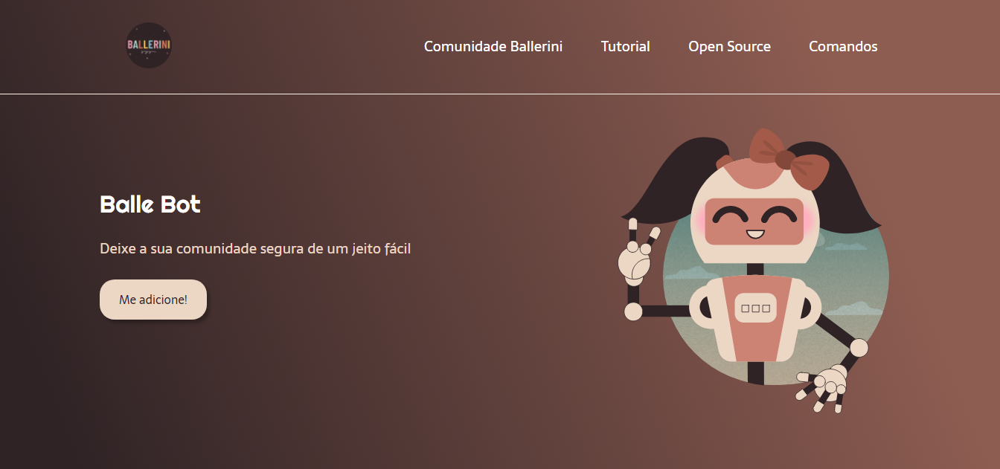
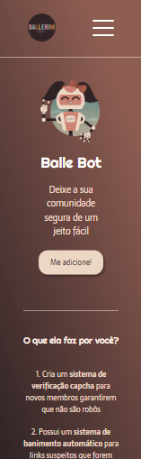

<h1 align="center">
    
</h1>

# ✉ About

A responsive landing page for the BalleBot bot on discord 🤖.

# 🌆 Images

<div>
  
  
  
</div>

# ✨ Figma design

You can access the website design by the following link:

[Access Figma Design](https://www.figma.com/file/myqP66iQwzjwjrIAJyyrip/BalleBot?node-id=0%3A1)

# 👨‍💻👩‍💻 Use the app

You can access the application by clicking on the link below:

[Access BalleBot](https://ballebot-al.vercel.app)

# 💻 Technologies used in this project

- HTML 
- CSS
- Sass
- JavaScript

# ❓ How to use it

```bash

git clone https://github.com/arthur-lage/ballebot-landing-page.git

cd ballebot-landing-page

# Open the index.html file

```
